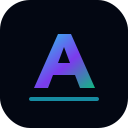
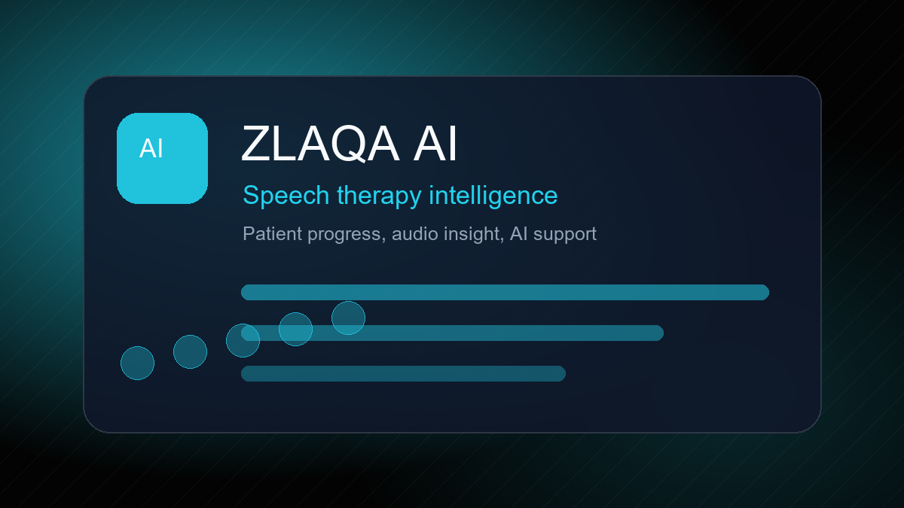
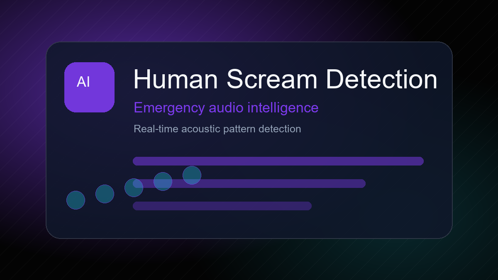
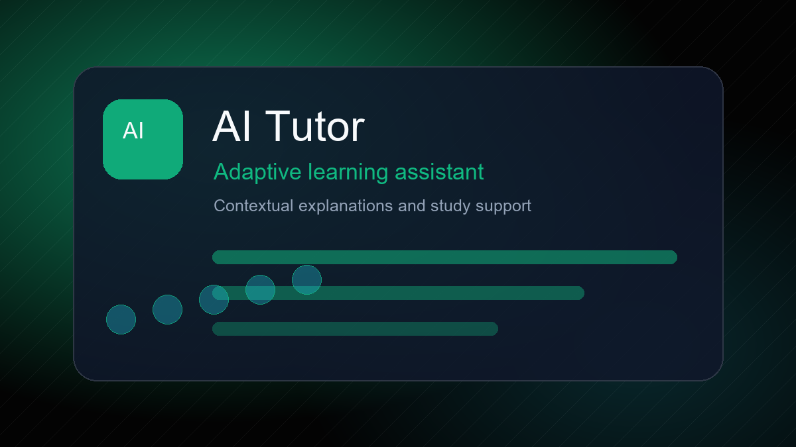

<picture>
  <source media="(prefers-color-scheme: dark)" srcset="assets/dark.svg">
  <source media="(prefers-color-scheme: light)" srcset="assets/light.svg">
  
</picture>

 

 

  &nbsp;&nbsp;
  &nbsp;&nbsp;
  &nbsp;&nbsp;
  

##  About Me

AI & Django Developer passionate about Machine Learning, Deep Learning, AI-powered Healthcare, Speech Processing, Computer Vision, and Full Stack Development.

Currently leading development of **ZLAQA AI**, an AI-powered Speech Therapy Platform focused on practical, human-centered healthcare intelligence.

 

## Tech Stack

 

## Featured Projects

<table>
  <tr>
    <td width="50%">
      
      <h3>ZLAQA AI</h3>
      
AI-powered Speech Therapy Platform for intelligent therapy workflows, patient progress support, and healthcare-focused automation.

    </td>
    <td width="50%">
      
      <h3>Human Scream Detection</h3>
      
Audio intelligence project for recognizing emergency acoustic patterns with machine learning and real-time signal processing.

    </td>
  </tr>
  <tr>
    <td width="50%">
      
      <h3>AI Tutor</h3>
      
Personalized learning assistant designed around adaptive explanations, contextual tutoring, and practical student support.

    </td>
    <td width="50%">
      <h3>Machine Learning Projects</h3>
      
Computer vision, speech processing, healthcare AI, Django systems, and full-stack experiments built with Python-first engineering.

    </td>
  </tr>
</table>

 

## GitHub Intelligence

 

## Contribution Snake

  <picture>
    <source media="(prefers-color-scheme: dark)" srcset="https://raw.githubusercontent.com/anfas-kp/anfas-kp/output/github-contribution-grid-snake-dark.svg">
    <source media="(prefers-color-scheme: light)" srcset="https://raw.githubusercontent.com/anfas-kp/anfas-kp/output/github-contribution-grid-snake.svg">
    
  </picture>

 

  
<b>Current Focus</b>

   
  
Building AI systems for healthcare, speech therapy, speech processing, and useful full-stack products with Django, Python, and modern AI tooling.

  
<b>Engineering Direction</b>

   
  
Python AI engineering, practical machine learning, computer vision, backend architecture, developer experience, and open source learning.

 

## Connect

  

 

Designed as a GitHub-native profile system with pure SVG motion, responsive theme-aware hero art, and generated halftone portrait geometry.

