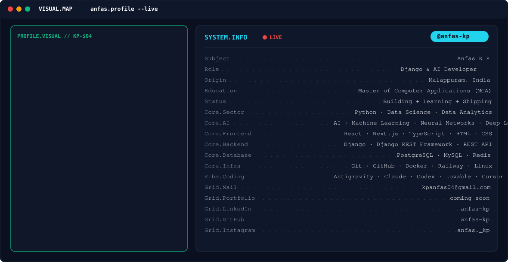

<!-- ===== THEME-AWARE HERO BANNER ===== -->
<picture>
  <source media="(prefers-color-scheme: dark)" srcset="assets/dark.svg">
  <source media="(prefers-color-scheme: light)" srcset="assets/light.svg">
  
</picture>

<br/><br/>

<!-- ===== SOCIAL BADGES ===== -->
<p align="center">
  <a href="mailto:kpanfas04@gmail.com">
    
  </a>
  &nbsp;&nbsp;
  <a href="https://www.linkedin.com/in/anfas--kp/">
    
  </a>
  &nbsp;&nbsp;
  <a href="https://instagram.com/anfas._kp">
    
  </a>
</p>

<br/>

<!-- ===== GITHUB STATS & STREAK ===== -->
<div align="center">

  <!-- Streak Card — 100% Width -->
  <picture>
    <source media="(prefers-color-scheme: dark)" srcset="https://streak-stats.demolab.com/?user=anfas-kp&hide_border=true&background=0A101F&stroke=22D3EE&ring=A78BFA&fire=10B981&currStreakLabel=22D3EE&sideLabels=94A3B8&currStreakNum=F8FAFC&sideNums=F8FAFC&dates=64748B&titleColor=22D3EE&card_width=1180" />
    
  </picture>

  <br/><br/>

  <!-- Stats & Top Languages — Side by Side (49% Width Each) -->
  <!-- Note: Replace YOUR_VERCEL_INSTANCE_URL with your self-hosted Vercel deployment URL -->
  <picture>
    <source media="(prefers-color-scheme: dark)" srcset="https://github-readme-stats-sigma-rosy-28.vercel.app/api?username=anfas-kp&show_icons=true&count_private=true&include_all_commits=true&hide_rank=true&hide_border=true&title_color=22D3EE&icon_color=A78BFA&text_color=94A3B8&bg_color=0A101F&card_width=500" />
    
  </picture>
  <picture>
    <source media="(prefers-color-scheme: dark)" srcset="https://github-readme-stats-sigma-rosy-28.vercel.app/api/top-langs/?username=anfas-kp&layout=compact&hide_border=true&title_color=22D3EE&text_color=94A3B8&bg_color=0A101F&card_width=500" />
    
  </picture>

</div>

<br/>

<!-- ===== CONTRIBUTION SNAKE ===== -->
<p align="center">
  <picture>
    <source media="(prefers-color-scheme: dark)" srcset="https://raw.githubusercontent.com/anfas-kp/anfas-kp/output/github-contribution-grid-snake-dark.svg" />
    <source media="(prefers-color-scheme: light)" srcset="https://raw.githubusercontent.com/anfas-kp/anfas-kp/output/github-contribution-grid-snake.svg" />
    
  </picture>
</p>

---

## 👋 Hey, I'm Anfas K P

### Django & AI Developer • Python Engineer • Creative Technologist

My work sits at the intersection of **backend engineering, artificial intelligence, automation, cloud deployment, and visual design**.

> **I build software that works intelligently — and I care about how it looks and feels.**

---

## 🛠️ Technology & Stack

### Core Sector
`Python` • `Data Science` • `Data Analytics`

### Core AI
`AI` • `Machine Learning` • `Neural Networks` • `Deep Learning`

### Core Frontend & Backend
`React` • `Next.js` • `TypeScript` • `HTML` • `CSS` • `Django` • `Django REST Framework` • `REST API`

### Core Database & Infrastructure
`PostgreSQL` • `MySQL` • `Redis` • `Git` • `GitHub` • `Docker` • `Railway` • `Linux`

### ⚡ Vibe Coding
`Antigravity` • `Claude` • `Codex` • `Lovable` • `Cursor`

---

## ⚡ Profile Identity

```text
┌─────────────────────────────────────────┐
│         DJANGO & AI DEVELOPER           │
├─────────────────────────────────────────┤
│  🐍 Python & Django REST Framework      │
│  🤖 Artificial Intelligence & LLMs      │
│  📊 Data Science & Machine Learning     │
│  ⚙️ Production Infrastructure & Docker  │
│  🎨 Visual Design & Creative Tech       │
└─────────────────────────────────────────┘
```
